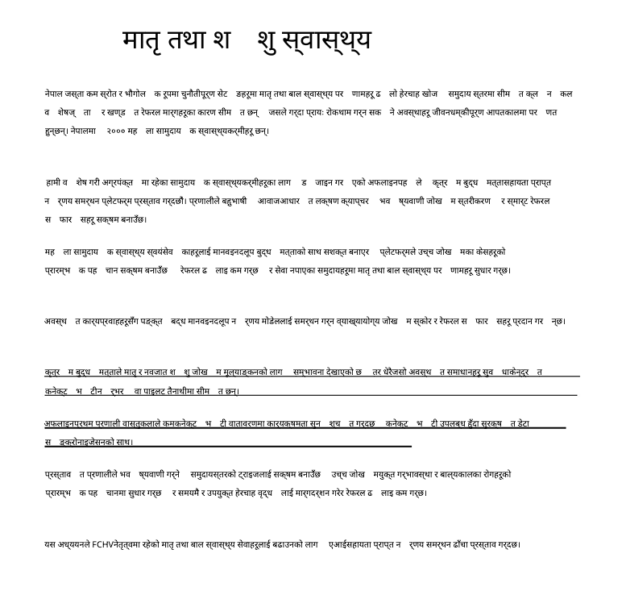
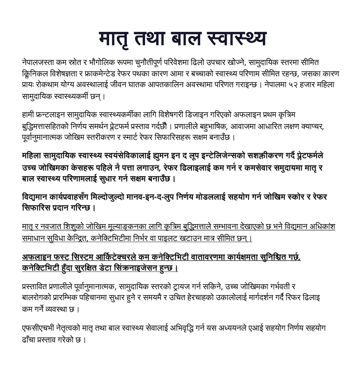

# Layout-Preserving Document Translator
### Translate PDFs without breaking formatting

> A multilingual document translator for PDF, DOCX, and CSV/TSV that preserves layout, tables, and styling — something Google Translate fails to do for Nepali documents.

> **Baseline:** Google Translate is used as the reference system for PDF and DOCX translation quality. CSV and TSV formats are not supported by Google Translate.

---

## ❌ The Problem

Google Translate works well for plain text — but fails on **real documents**.

When translating PDFs (English ↔ Nepali):

- Bold headings become plain text  
- Italic text loses distinction  
- Layout and structure break  
- Devanagari words split incorrectly across lines  

This isn’t just cosmetic.

> In **medical reports, legal documents, and government forms**, formatting carries meaning.  
> Losing it can change how a document is understood.

Additionally:

- ❌ **No support for CSV/TSV files** in Google Translate  
- ❌ Limited reliability for structured documents  

---

## ✅ Our Solution

This project preserves both **content and structure**:

- Maintains original document layout  
- Keeps formatting (bold, color, links) intact  
- Fixes Devanagari rendering issues  
- Supports **CSV/TSV** (not supported by Google Translate)  

---

## 🎯 Key Insight

- DOCX → comparable to baseline  
- PDF → **major improvement over Google Translate**  
- CSV/TSV → **new capability beyond baseline**

---

**Powered by** [TMT API](https://tmt.ilprl.ku.edu.np)  
LowResource Labs · Google TMT Hackathon 2026

---

## Side-by-Side Comparison

The screenshots below present a side-by-side comparison of the same English source PDF translated into Nepali using Google Translate and this system.

All corresponding test files — including PDF, DOCX, CSV, and TSV formats — are available in the `TestFiles/` directory.

### Original English Document


### Google Translate Output (Nepali)


> Bold headings reduced to plain text. Syllabic splitting splits Devanagari words incorrectly across line breaks.

### This Project's Output (Nepali)


> Bold and color preserved exactly as in the original. The syllabic splitting issue has been resolved. Devanagari rendered correctly with no syllabic splitting. Layout matches the source document.

---

## What We Preserve That Google Translate Does Not

| Formatting Feature | Google Translate (EN↔NE PDF/DOCX) | This Project |
|---|---|---|
| **Bold text** | ✗ Lost | ✓ Preserved |
| **Syllabic splitting fix** | ✗ Broken | ✓ Correct |
| **Underline** | ✓ Preserved | ✓ Preserved |
| **Text color** | ✓ Preserved | ✓ Preserved |
| **Hyperlinks** | ✓ Preserved | ✓ Preserved |
| **Images** | ✓ Preserved | ✓ Preserved |
| **Italic text** | ✗ Lost | ✗ Lost |
| **Devanagari shaping (no boxes)** | ✓ | ✓ |
| **DOCX bold/italic/color/font** | ✓ | ✓ |
| **DOCX table structure** | ✓ | ✓ |
| **CSV/TSV translation** | ✗ Not supported | ✓ Fully supported |

---

## Test Files

The `TestFiles/` directory contains real translation comparisons across all supported formats:

```
TestFiles/
├── pdfs_translation/
│   ├── TestFile_eng.pdf                        ← Original English PDF
│   ├── TestFile_googleTranslate_output_ne.pdf  ← Google Translate output (for comparison)
│   ├── TestFile_LowResourceLabs_output_ne.pdf  ← This project's Nepali output
│   └── TestFile_eng_LowResourceLabs_tmg.pdf    ← This project's Tamang output
│
├── docx_translation/
│   ├── TestFile_eng.docx                            ← Original English DOCX
│   ├── TestFile_googleTranslate_output_ne.docx      ← Google Translate output (for comparison)
│   ├── TestFile_LowResourceLabs_output_ne.docx      ← This project's Nepali output
│   └── TestFile_eng_LabResourceLabs_tmg.docx        ← This project's Tamang output
│
├── csv_translation/
│   ├── business-operations-survey-2022.csv     ← Original CSV
│   ├── business-operations-survey-2022_ne.csv  ← Nepali translation
│   └── business-operations-survey-2022_tmg.csv ← Tamang translation
│
└── tsv_translation/
    ├── business-operations-survey-2022.tsv     ← Original TSV
    ├── business-operations-survey-2022_ne.tsv  ← Nepali translation
    └── business-operations-survey-2022_tmg.tsv ← Tamang translation
```

> **Note:** Google Translate does not support CSV or TSV input, so no Google Translate comparison files exist for those formats.

---

## Quick Start

### 1. System Dependencies

WeasyPrint requires Pango for correct Devanagari shaping on Linux:

```bash
sudo apt update
sudo apt install -y \
  libpango-1.0-0 libpangoft2-1.0-0 libpangocairo-1.0-0 \
  libcairo2 libgdk-pixbuf2.0-0 \
  fonts-freefont-ttf fonts-noto fonts-noto-core \
  shared-mime-info
```

### 2. Python Packages

```bash
pip install flask requests python-dotenv pdfplumber pymupdf \
            weasyprint python-docx lxml openpyxl
```

> **Note:** `lxml` is required by `docx_processor.py` for raw XML iteration over table cells and hyperlinks. It is not listed in `requirements.txt` but must be installed.

### 3. Environment Variables

Copy `.env.example` to `.env` and fill in your TMT API credentials:

```bash
TMT_API_URL=https://tmt.ilprl.ku.edu.np/lang-translate
TMT_API_KEY=your_api_key_here
```

Both variables are required. The server will refuse to start if either is missing.

### 4. Run

```bash
git clone https://github.com/swastik-bhandari/Layout-Preserving-Document-Translator-Better-PDF-Translation-than-Google-Translate-.git
cd Layout-Preserving-Document-Translator-Better-PDF-Translation-than-Google-Translate-
python app.py --port 5050
```

Open **http://localhost:5050** in your browser.

---

## Architecture

```
┌─────────────────────────────────────────────────────────────────┐
│                        Browser UI                               │
│          Drag & drop · Language selector · Live progress        │
└──────────────────────────┬──────────────────────────────────────┘
                           │ POST /translate  (multipart/form-data)
                           ▼
┌─────────────────────────────────────────────────────────────────┐
│                      app.py  (Flask)                            │
│  • Background threading     • GET /status/<id>  (live log)      │
│  • 50 MB upload limit       • GET /download/<id>                │
│  • GET /  (serves frontend) • GET /health                       │
└──────┬──────────────┬──────────────┬───────────────────────────┘
       │ .pdf         │ .docx        │ .csv / .tsv
       ▼              ▼              ▼
┌────────────┐  ┌────────────┐  ┌────────────┐
│pdf_        │  │docx_       │  │csv_        │
│processor   │  │processor   │  │processor   │
│.py         │  │.py         │  │.py         │
└─────┬──────┘  └─────┬──────┘  └─────┬──────┘
      │               │               │
      └───────────────┴───────────────┘
                      │
                      ▼
          ┌───────────────────────┐
          │   translator.py       │
          │  TMT API client       │
          │  Retry · Backoff      │
          │  Sentence splitting   │
          └───────────────────────┘
                      │
                      ▼
          https://tmt.ilprl.ku.edu.np
              /lang-translate
```

---

## PDF Pipeline — How It Works

This is the most technically significant part of the project. The pipeline has three distinct phases:

### Phase 1 — Extraction (Dual-Library Strategy)

We use **two libraries simultaneously** because each does something the other cannot:

```
Original PDF
    │
    ├─► pdfplumber.extract_words()
    │     Word-level bounding boxes (x0, y0, x1, y1)
    │     Used for: layout clustering, heading detection, table detection
    │     Cannot do: italic, color, link flags
    │
    └─► PyMuPDF  get_text('dict')
          Per-span OpenType flags:
            bit 4 → bold
            bit 1 → italic
            int   → color as 0xRRGGBB
          page.get_links()  → URI + rect per annotation
          get_drawings()    → fill rectangles (table cell backgrounds)
                            → thin horizontal lines (real underlines)
          get_pixmap()      → full page PNG at 2× resolution
```


### Phase 2 — Translation

Each extracted text block is sent to the TMT API individually. The translator uses:

- **Sentence-aware splitting** on `.!?` and Devanagari danda `।` so long paragraphs are split into meaningful units before API calls
- **Exponential backoff with ±20% jitter** on failures (avoids thundering-herd on retry)
- **Connection pooling** via `requests.Session` + `HTTPAdapter` (4 persistent connections, pool size 8)
- **Graceful fallback** — if a block fails after 4 retries, the original text is kept so the document is never partially broken

### Phase 3 — Reconstruction (The Key Innovation)

**This is where we beat Google Translate.**

We use the same high-level approach Google uses (original page as background image + translated text overlaid), but we add the formatting layer Google omits for Nepali:

```
For each page:
  1. PyMuPDF renders page → PNG at 2× resolution (crisp, captures all graphics)
  2. White <div>s are placed over original text areas (erase original)
  3. Translated text <div>s are placed at original coordinates with:
       font-weight: bold/normal          ← from PyMuPDF span flag bit 4
       font-style:  italic/normal        ← from PyMuPDF span flag bit 1
       text-decoration: underline/none   ← from drawn path detection
       color: #rrggbb                    ← from PyMuPDF span color integer
  4. If a block has a link annotation → wrapped in <a href="...">
  5. Table cells → background color from actual page drawings (not hardcoded)
  6. WeasyPrint renders the HTML → PDF
       └─► Pango → HarfBuzz → OpenType shaping → correct Devanagari glyphs
```


## DOCX Pipeline

DOCX files are XML archives. The translator walks the document tree at the XML level, which gives complete control over formatting.

### The Three Bugs We Solved

**1. Phantom merged cells (python-docx bug)**

`python-docx`'s `row.cells` uses `vMerge` to repeat vertically-merged cells across rows. This caused the same `<w:tc>` element to appear multiple times under different row/column indices. Our `seen` set (designed to skip true merged cells) was then incorrectly skipping unmerged cells that happened to share an element ID.

Fix: iterate raw `<w:tc>` XML elements directly per row:


**2. Hyperlink paragraphs have zero runs**

`para.runs` only sees `<w:r>` elements that are direct children of `<w:p>`. Text inside `<w:hyperlink>` sits one level deeper. Result: all hyperlink text was silently skipped.

Fix: extract text from ALL `<w:t>` descendants using XML iteration:


**3. Full paragraph context for translation**

All `<w:t>` text nodes across runs are joined before sending to the API, so the translator receives coherent sentences rather than individual run fragments.

### What Gets Translated
- Body paragraphs (all styles: Normal, Heading 1–9, Title, Subtitle, List)
- Table cells (all rows, all columns, all nested tables)
- Headers and footers (first page, odd page, even page variants)
- Text boxes and drawing shapes with text frames

### What Is Preserved
- Bold, italic, underline, strikethrough — via `<w:rPr>` XML clone
- Font name, font size, font color, highlight color
- All paragraph styles (headings, lists, alignment, indent)
- Table structure: cell widths, borders, shading, merge state
- Embedded images (untouched — they are not text)

---

## CSV/TSV Pipeline

### Encoding & Delimiter Auto-Detection

`utf-8-sig` is tried first because Excel exports always write a UTF-8 BOM. Delimiter is detected by `csv.Sniffer` with fallback to counting occurrences of `,`, `\t`, `|`, `;`.

### Smart Skip Logic

Cells are skipped (not sent to API) if they are: pure numbers, dates (`DD/MM/YYYY`), URLs (`https://...`), or short all-uppercase acronyms (`USD`, `N/A`, `ID`).

---

## Translation API Client

The API payload uses `src_lang` and `tgt_lang` fields. Responses are expected with `message_type: "SUCCESS"` and the translated text in `output`. Authentication is via `Authorization: Bearer <TMT_API_KEY>` header. The shared `requests.Session` with `HTTPAdapter(pool_connections=4, pool_maxsize=8)` reuses TCP connections across all translation calls — no per-request handshake overhead, significantly faster for large documents.

---

## Project Structure

```
tmt-translator/
│
├── app.py                      # Flask server — job queue, routes, file handling
│   ├── POST /translate         # Upload file, start background translation job
│   ├── GET  /status/<id>       # Poll progress: done count, total, log tail
│   ├── GET  /download/<id>     # Download completed translated file
│   ├── GET  /                  # Serves frontend/index.html
│   └── GET  /health            # Service liveness check
│
├── frontend/
│   └── index.html              # Single-file UI — no build step, no dependencies
│                               # Drag-drop · language swap · live log · ETA
│
├── backend/
│   ├── __init__.py
│   │
│   ├── translator.py           # TMT API client (115 lines)
│   │   ├── translate_sentence  # Single segment with retry/backoff
│   │   ├── translate_paragraph # Sentence-split then join
│   │   └── split_sentences     # Regex on .!?। boundaries
│   │
│   ├── pdf_processor.py        # PDF pipeline (824 lines)
│   │   ├── _spans_for_page     # PyMuPDF → per-span bold/italic/color
│   │   ├── _links_for_page     # PyMuPDF → hyperlink URI + rect
│   │   ├── _table_fills_for_page # PyMuPDF drawings → cell background colors
│   │   ├── _block_style        # Merge span flags onto pdfplumber blocks
│   │   ├── extract_pdf_structure  # Full extraction: layout + formatting + image
│   │   ├── translate_pdf_structure # Block-by-block + table cell translation
│   │   ├── _page_to_html       # Build HTML overlay per page
│   │   └── reconstruct_pdf     # WeasyPrint render → output PDF
│   │
│   ├── docx_processor.py       # DOCX pipeline (217 lines)
│   │   ├── _iter_real_cells    # Raw <w:tc> XML iteration (no phantom merges)
│   │   ├── _para_text          # All <w:t> descendants (includes hyperlinks)
│   │   ├── _set_para_text      # Write-back via XML <w:t> nodes
│   │   └── translate_docx      # Body + tables + headers/footers + textboxes
│   │
│   └── csv_processor.py        # CSV/TSV pipeline (154 lines)
│       ├── _detect             # Encoding + delimiter auto-detection
│       ├── _skippable          # Filter numbers, dates, URLs, acronyms
│       └── translate_csv       # Position-keyed queue + text cache
│
├── TestFiles/                  # Translation comparison files for all formats
│   ├── pdfs_translation/       # Original + Google Translate + this project (PDF)
│   ├── docx_translation/       # Original + Google Translate + this project (DOCX)
│   ├── csv_translation/        # Original + translated CSV files
│   └── tsv_translation/        # Original + translated TSV files
│
├── screenshots/                # Visual comparison screenshots (used in README)
│   ├── TestFile_eng.png
│   ├── TestFile_googleTranslate_ne.png
│   └── TestFile_LowResourceLabs_ne.png
│
├── .env                        # API credentials (TMT_API_URL, TMT_API_KEY)
└── requirements.txt
```


---

## Dependencies

### Python packages

| Package | Version (requirements.txt) | Purpose |
|---|---|---|
| `flask` | 2.3.3 | HTTP server, job routing |
| `pymupdf` (fitz) | 1.23.8 | PDF render, span flags, link annotations, drawings |
| `pdfplumber` | 0.9.0 | Word-level bbox extraction, table detection |
| `weasyprint` | latest | HTML→PDF with Pango+HarfBuzz (Devanagari shaping) |
| `python-docx` | 0.8.11 | DOCX read/write |
| `lxml` | latest | Raw XML iteration in docx_processor (**required, not in requirements.txt**) |
| `requests` | 2.31.0 | TMT API calls with connection pooling |
| `python-dotenv` | 1.0.0 | Load `.env` credentials |
| `openpyxl` | 3.1.2 | Spreadsheet support |

### System packages (Linux/WSL)

WeasyPrint needs Pango, Cairo, and Noto fonts for correct Devanagari rendering:

```bash
sudo apt install -y \
  libpango-1.0-0 libpangoft2-1.0-0 libpangocairo-1.0-0 \
  libcairo2 libgdk-pixbuf2.0-0 \
  fonts-freefont-ttf fonts-noto fonts-noto-core \
  shared-mime-info
```

---

## Supported Languages

The TMT API currently supports:

| Code | Language |
|---|---|
| `en` | English |
| `ne` | Nepali (नेपाली) |
| `tmg` | Tamang |

All three can be used as source or target in the UI.

---

## API Routes

| Method | Route | Description |
|---|---|---|
| `GET` | `/` | Serves the frontend UI |
| `POST` | `/translate` | Upload file + start background translation job |
| `GET` | `/status/<job_id>` | Poll job progress (progress, total, log tail) |
| `GET` | `/download/<job_id>` | Download completed translated file |
| `GET` | `/health` | Liveness check, returns version and upload dir |

---

*Built for the Google TMT Hackathon 2026 · LowResource Labs*
